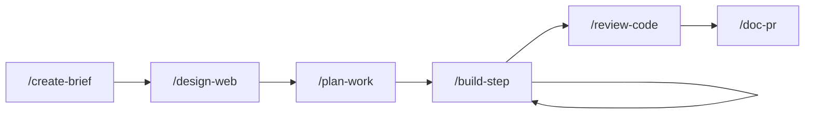

# Guide

How to think about and use **ai-dev-system** in day-to-day work. For build commands, field reference, and repo layout, see [README.md](README.md).

---

## Philosophy

This package treats AI-assisted development as **repeatable engineering**, not open-ended chat.

**Human control, smallest useful change.** You stay in the loop. Every command pushes toward one concrete artifact or one verifiable code change. The agent matches your codebase, stays in scope, and stops when requirements are ambiguous — rather than guessing.

**One source of truth.** Skills, commands, rules, and output schemas live in `recipes/`. You edit YAML and Markdown once; the build emits Cursor and Claude Code artifacts. No drift between tools.

**Cost-efficient context.** Not everything loads at once:
- **Rules** — always-on guardrails (small, universal)
- **Skills** — expertise loaded when relevant (path-scoped stack skills, or manual `@` layering for design modes)
- **Commands** — structured workflows that bind to output schemas
- **Schemas** — fixed document shapes so the agent does not invent structure each time

**Boring defaults.** Proven stacks, monoliths, synchronous flows unless operational pressure says otherwise. Design commands capture *why*; build commands implement *one task*.

---

## Who this is for

| Audience | Why it helps |
|---|---|
| **Solo developers** | A lightweight process you can run alone: brief → design → plan → build in steps → review. Artifacts in `docs/ai/` become your paper trail and context for the next session. |
| **Small teams (2–10)** | Shared vocabulary and document shapes. Everyone uses the same slash commands; reviews reference the same `NNN-REVIEW.md` format; plans decompose work into independently testable tasks. |
| **Not aimed at** | Large org process (RACI matrices, mandatory gates), or teams that want the agent to freestyle without schemas. |

Install once per project — see [Remote install](#remote-install) below or [README — Install](README.md#install-into-a-project).

---

## Remote install

From your app repo (no clone, no Python):

```bash
curl -fsSL https://raw.githubusercontent.com/yskaya/ai-dev-system/main/scripts/install-remote.sh | bash
```

This copies predefined rules, commands, skills, and schemas into `.cursor/` (and `.claude/` unless you pass `--cursor-only`). Pin a version with `AI_DEV_SYSTEM_VERSION=v0.1.0` when [releases](https://github.com/yskaya/ai-dev-system/releases) exist.

**Overwrite warning:** install replaces the entire `.cursor/` and `.claude/` artifact trees. Do not mix personal slash commands or rules in those folders unless you accept losing them on reinstall — use a fork with `AI_DEV_SYSTEM_REPO`, or patch after install and skip upgrades.

Then work entirely inside your repo's `.cursor/` or `.claude/` tree (and your app's `docs/ai/` for command outputs).

---

### Work id (`NNN`)

A zero-padded id (`001`, `002`, …) groups one initiative: brief, design, plan, reviews, and issues for the same feature or effort.

Default location: `docs/ai/`. Pick another folder if you prefer — stay consistent within the repo.

| Artifact | When you create it |
|---|---|
| `NNN-BRIEF.md` | New product or greenfield scope |
| `NNN-DESIGN.md` | Architecture decisions before significant build work |
| `NNN-PLAN.md` | Task breakdown for features or MVP delivery |
| `NNN-REFACTOR.md` | Phased structural change (no feature mix-in) |
| `NNN-REVIEW.md` | Code or security review output |
| `NNN-ISSUES.md` | Tracked findings from reviews |
| `ISSUES.md` | Ad-hoc bugs (no `NNN`) |

Commands replace `NNN` with your id (e.g. `001-PLAN.md`).

---

## How responsibilities split

Think of four layers, from always-on to on-demand:

```
Rules          →  always (guardrails)
Commands       →  you invoke (workflows)
Skills         →  loaded by command or @mention (expertise)
Schemas        →  bound to commands (output shape)
```

### Rules

**What:** Short, permanent constraints — operating principles, TypeScript discipline, when to write docs.

**Why separate:** They apply to *every* session without you remembering to ask. Kept small to limit token cost.

**Examples:** Stay in scope; no rewrite without reason; follow schema structure for command outputs; do not approve reviews while P0 issues remain.

**Cursor:** `.mdc` rules with `alwaysApply` or path `globs`.  
**Claude:** `.md` rules with optional `paths` scoping.

You rarely invoke rules directly — they are the floor.

#### Rules reference

| Rule | Scope | Purpose |
|---|---|---|
| `00-operating-principles` | Always on | Smallest useful change; stay in scope; follow command schemas; stop when requirements conflict; print **Next recommended step** at end of slash commands |
| `01-fullstack-typescript` | `**/*.{ts,tsx,js,jsx,mts,cts,mjs,cjs}` | Baseline TS/JS discipline; stack skills layer implementation detail on matching paths |
| `02-documentation` | Always on | When to write docs; command outputs must follow schemas — no invented structure |

Bodies live in `recipes/rules/*.md`; build emits platform-specific rule files into your project.

### Commands

**What:** Slash workflows (`/create-brief`, `/build-step`, …) with a defined job and optional schema binding.

**Why separate:** Commands are *actions you choose* at a phase of work. They orchestrate skills and point at the right output document.

**Patterns:**
- **Document commands** — `source` + `output` fields tie the command to a schema (e.g. `/plan-work` → `NNN-PLAN.md`)
- **Action commands** — no output file; they operate on code or diffs (e.g. `/build-step`, `/debug`, `/doc-pr`)

**Model routing (Claude):** Design and review commands prefer Opus; planning uses Sonnet. Cursor commands omit model hints.

### Skills

**What:** Focused expertise — stack implementation (`stack-react`), architecture modes (`frontend-architecture`), or domain bundles (`auth`).

**Why separate:** Skills are composable. A command lists the skills it needs; you can add more with `@skill-name` without editing recipes.

**Two kinds:**

| Kind | Id pattern | How it loads | Use for |
|---|---|---|---|
| **Stack** | `stack-*` | Auto-attaches on matching file paths *and* can be injected by commands/skillsets | Implementation details — hooks, NestJS patterns, LLM SDK usage |
| **Mode** | bare name | Manual `@` or wired in command `skills:` | Design reasoning — microservices split, client/server boundary, auth model |

**Skillsets** bundle skills for convenience:

| Skillset | Members | Auto-inject in commands? |
|---|---|---|
| `set-web` | stack-react, stack-nextjs | Yes (tech-only) |
| `set-api` | stack-node, stack-nestjs | Yes |
| `set-service` | stack-nestjs | Yes |
| `set-microservice` | stack-nestjs, microservices | **No** — layer manually: `/build-step @set-microservice` |

Mixed skillsets must not appear in a command's `skills:` list (enforced by tests) — otherwise a design mode would leak into every build session.

Some mode skills declare `sections:` — they update only those headings in `NNN-DESIGN.md` (or similar), leaving the rest untouched.

### Schemas

**What:** Markdown section templates in `schemas/` — the skeleton of command output documents.

**Why separate:** Schemas decouple *structure* from *instruction*. Commands say what to do; schemas say what the file must contain. The agent fills sections in place rather than inventing headings.

**Index:** `recipes/outputs.yaml` lists schemas for validation; build copies them to `dist/*/schemas/`.

#### Schemas reference

| Schema file | Purpose | Created by | Output path |
|---|---|---|---|
| `BRIEF.md` | Product intent — goal, MVP, non-goals, success criteria | `/create-brief` | `docs/ai/NNN-BRIEF.md` |
| `DESIGN.md` | Full-stack architecture — modules, contracts, auth, data flow, decisions | `/design-web` | `docs/ai/NNN-DESIGN.md` |
| `PLAN.md` | Milestones with build-step-sized tasks and acceptance criteria | `/plan-work` | `docs/ai/NNN-PLAN.md` |
| `REFACTOR.md` | Phased structural change — test-gated milestones, no feature mix-in | `/plan-refactor` | `docs/ai/NNN-REFACTOR.md` |
| `REVIEW.md` | Review decision, P0–P3 findings, security section | `/review-code`, `/review-security` | `docs/ai/NNN-REVIEW.md` |
| `ISSUES.md` | Bug investigation block + prioritized backlog | `/debug` | `ISSUES.md` or `NNN-ISSUES.md` |
| `SETUP.md` | Repo scaffold — stack, folder tree, env vars, scripts | *(no command)* | Create manually, e.g. `docs/ai/SETUP.md` |

---

## Document (schema) structure

Schemas are intentionally minimal — headings and one-line hints, not prose templates.

**Design docs (`DESIGN.md`)** — architecture for a feature or system: complexity, module map, API contracts, data model, auth, data flow, AI pipeline, decisions, risks.

**Plans (`PLAN.md`)** — milestones with checkbox tasks. Each task names affected files and acceptance criteria sized for one `/build-step`.

**Briefs (`BRIEF.md`)** — product intent only: goal, MVP scope, non-goals, success criteria, assumptions, risks. No implementation.

**Refactor plans (`REFACTOR.md`)** — phased structural work. Each milestone must pass tests before the next; no feature or bug-fix mix-in per phase.

**Reviews (`REVIEW.md`)** — decision (Approve / Request changes / Hold), blocking issues, warnings, security findings, prod risks.

**Issues (`ISSUES.md`)** — one active investigation block (symptom → reproduction → root cause → fix → regression risk → verification) plus prioritized backlog lists (P0–P3).

**Setup (`SETUP.md`)** — stack, folder tree, dev setup, env vars, scripts, known issues. Use when documenting a new repo or module scaffold (no dedicated command — create manually or during first build step).

When a command sets `sections:`, only those schema headings are in scope for that skill or command (useful for large docs like `NNN-DESIGN.md`).

---

## Templates (build layer)

Templates in `templates/` are **not** something you edit during normal product work. They define how `scripts/build.py` wraps recipe bodies into platform-specific files (Cursor `.mdc` rules, Claude frontmatter with `triggers` and `model`, skill `paths` blocks, etc.).

**When you care:** Forking or extending this package — e.g. adding a new frontmatter field. Then update the `.tmpl` file and the placeholder assembly in `build.py` together. See [templates/README.md](templates/README.md) for placeholder reference.

**When you don't:** Installing and using the system in your app repo. Edit `recipes/` only.

---

## Cursor vs Claude Code

Install writes **both** `.cursor/` and `.claude/` by default. Use one tool, both, or split work across them — recipes compile to both from the same source.

### When to use which

| Tool | Best for | Why |
|---|---|---|
| **Cursor** | Day-to-day coding, `/build-step`, `/debug`, `/write-unit-tests` | IDE-integrated edits; stack skills auto-attach on matching file paths |
| **Claude Code** | `/create-brief`, `/design-web`, `/review-code`, `/review-security` | Long reasoning sessions; explicit **Opus** routing on design and review commands |
| **Either** | `/plan-work`, `/plan-refactor`, `/doc-pr` | Planning uses **Sonnet** on Claude; Cursor works fine if you prefer one tool |

You do not need both installed in daily use — pick one primary editor and keep the other tree for occasional sessions or teammates.

### Platform differences (when extending or debugging)

| Feature | Cursor | Claude Code |
|---|---|---|
| Rules | `.mdc` — `alwaysApply`, optional `globs` | `.md` — optional `paths` frontmatter |
| Stack skill auto-attach | `paths` in `SKILL.md` frontmatter | Skills listed on command via `Skills: @…` line |
| Command frontmatter | `description` only | `description`, `triggers`, optional `model` |
| Model routing | None (your model picker) | `opus` on design/review/security; `sonnet` on planning |
| Slash commands | `.cursor/commands/*.md` | `.claude/commands/*.md` |

Mixed skillsets (`@set-microservice`) are **manual on both platforms** — never auto-injected into `/build-step`.

### Split-workflow example (solo dev)

A practical pattern when you use both tools:

**Session 1 — Claude Code (planning & design)**

1. `/create-brief` → commit `docs/ai/001-BRIEF.md`
2. `/design-web` → commit `001-DESIGN.md` (Opus; layer `@ai-architecture` if needed)
3. `/plan-work` → commit `001-PLAN.md`

**Session 2 — Cursor (implementation)**

4. Open `001-PLAN.md`; run `/build-step @set-api` for the first unchecked task
5. Repeat step 4 until all checkboxes pass — **always** include `@set-web`, `@set-api`, or `@set-service`

**Session 3 — Claude Code (review & ship)**

6. `/review-code` → `001-REVIEW.md`; `/review-security` if auth or external integrations changed
7. `/doc-pr` → open PR with generated description

Each session starts by reading committed `docs/ai/` files — no need to re-paste context from chat history.

See [examples/minimal/](examples/minimal/) for artifact shapes at step 3–6.

---

## Workflows

### New project (greenfield)



1. **Install** — remote curl install or local `install.py` ([README](README.md#install-into-a-project)).
2. **Brief** — `/create-brief` → `001-BRIEF.md`. Align on MVP and non-goals before code.
3. **Design** — `/design-web` → `001-DESIGN.md`. Layer `@ai-architecture`, `@realtime`, `@set-microservice`, or `@monorepo` if scope requires.
4. **Plan** — `/plan-work` → `001-PLAN.md`. Tasks must be one build-step each.
5. **Build loop** — `/build-step @set-web` (or `@set-api`, `@set-service`). Pick the skillset for the task's area. Repeat until milestones are checked off.
6. **Review** — `/review-code`; add `/review-security` for auth, inputs, or external integrations.
7. **Ship** — `/write-unit-tests` for gaps; `/doc-pr` for the PR body.

Optionally maintain `SETUP.md` once the scaffold exists so the next session (or teammate) can run the app quickly.

### New feature (existing codebase)

Skip or shorten steps based on size:

| Size | Typical path |
|---|---|
| **Small** (1–2 files, clear scope) | `/build-step` directly, or a short plan in `NNN-PLAN.md` first |
| **Medium** | `/plan-work` reading existing design docs → build loop → review |
| **Large / cross-cutting** | `/create-brief` or brief section in plan → `/design-web` for contract changes → `/plan-work` → build loop |

Always assign a new `NNN` when the feature needs its own plan and review trail.

### Refactoring

Structural debt — module boundaries, rename migrations, extract service — not bug fixes or features.

1. **Plan** — `/plan-refactor` → `NNN-REFACTOR.md`. Phases are test-gated; no mixed work per milestone.
2. **Execute** — Treat each refactor milestone like a plan task: one `/build-step`-sized change per phase, or work through REFACTOR checkboxes manually with the same discipline.
3. **Verify** — Tests green after each phase; `/review-code` before merge.
4. **Measure** — Fill REFACTOR **Measurements** when done.

If the refactor changes architecture, update `NNN-DESIGN.md` in the same initiative.

### Bug fix

1. **Investigate** — `/debug` → `ISSUES.md` (or `NNN-ISSUES.md` if tied to an initiative). Reproduce before theorizing; name root cause before editing.
2. **Fix** — Minimal change only; no drive-by refactors.
3. **Verify** — Regression steps from the Investigation section; `/write-unit-tests` when a test is practical.
4. **Ship** — `/doc-pr` for anything non-trivial.

For defects found in review, `/review-security` or `/review-code` may append to `NNN-ISSUES.md` — `/debug` picks up from there.

---

## Commands reference

| Command | Output | When to use | Notes |
|---|---|---|---|
| `/create-brief` | `NNN-BRIEF.md` | New product or greenfield; need aligned MVP scope | Skip for small changes to existing systems — use `/plan-work` |
| `/design-web` | `NNN-DESIGN.md` | Before significant build; API/auth/data-flow decisions | Reads brief when present; layer extra skills for AI, realtime, microservices |
| `/plan-work` | `NNN-PLAN.md` | Feature or MVP implementation breakdown | Tasks sized for `/build-step`; reads brief + design |
| `/plan-refactor` | `NNN-REFACTOR.md` | Structural debt, phased safe refactors | Not for features or bug fixes mixed into phases |
| `/build-step` | *(code)* | Implement next unchecked plan task | Layer `@set-web`, `@set-api`, `@set-service`, or `@set-microservice` |
| `/debug` | `ISSUES.md` | Reproduce and fix a bug | Investigation before code; minimal fix only |
| `/review-code` | `NNN-REVIEW.md` | Correctness, maintainability, plan alignment | Run `/review-security` for auth/input/integration surfaces |
| `/review-security` | `NNN-REVIEW.md` (Security section) | Adversarial security audit | Report-only; may append to ISSUES |
| `/write-unit-tests` | *(tests)* | After implementation or fix | Focus on behavior and regressions, not snapshots |
| `/doc-pr` | *(PR description)* | Before opening or updating a PR | Reads diff + brief/plan when available |

**Recommended habits**

- One `/build-step` per plan checkbox — mark `- [x]` only when acceptance criteria pass.
- Do not skip design for work that touches API contracts, auth, or multi-module boundaries.
- Run security review when the diff touches auth, user input, secrets, or third-party/AI integrations.
- Keep `NNN-*` files in version control — they are context for future sessions and reviewers.

### Next recommended step (workflow handoff)

When a slash command finishes, the agent prints a **Next recommended step** block as its final message. Each built command includes a compiled **When done** section that tells the agent what to recommend — review which artifact, run which command next, and which skills to layer manually.

The agent inspects project state for branching decisions (e.g. unchecked plan tasks → loop `/build-step`; all done → `/review-code`). It distinguishes **auto-attached** skills (listed in the command's `Skills:` line) from **manual** `@` skills you must add yourself.

Maintainers: workflow transitions live in `recipes/workflows.yaml` and are compiled into commands at build time.

---

## Skills reference

### Stack skills (path-scoped implementation)

| Skill | Auto-attaches on | Use when |
|---|---|---|
| `stack-react` | `*.tsx`, `*.jsx`, components, hooks | React hooks, effects, render behavior |
| `stack-nextjs` | Next.js app paths | App router, RSC, routing conventions |
| `stack-node` | Node server paths | Node runtime patterns |
| `stack-nestjs` | NestJS paths | Modules, DI, controllers, providers |
| `stack-ai` | AI/LLM code paths | LLM SDK integration, prompts, pipelines |

Prefer skillsets at build time: `@set-web`, `@set-api`, `@set-service`.

### Mode skills (design and reasoning — layer with `@`)

| Skill | Focus | Typical invocation |
|---|---|---|
| `frontend-architecture` | Client/server boundary, rendering, fetch strategy | `/design-web @frontend-architecture` |
| `backend-architecture` | Service boundaries, API design | `/design-web` (also in default skill list) |
| `architecture-docs` | Decision framing, complexity narrative | Wired into `/design-web` |
| `auth` | Auth and trust model | `/design-web`, `/review-security` |
| `ai-architecture` | LLM/RAG/chat pipeline design | Layer when AI is in scope |
| `realtime` | Live updates, WebSockets | Layer when realtime is in scope |
| `microservices` | Service decomposition | `@set-microservice` or `@microservices` |
| `monorepo` | Repo layout across packages | Greenfield or restructure |

### Skillsets (shortcuts)

| Invoke | Expands to |
|---|---|
| `@set-web` | stack-react + stack-nextjs |
| `@set-api` | stack-node + stack-nestjs |
| `@set-service` | stack-nestjs |
| `@set-microservice` | stack-nestjs + microservices |

---

## Customizing for your team

### Fork and rebuild (recommended for lasting changes)

1. **Adjust rules** — `recipes/rules/` for team conventions (keep always-on rules short).
2. **Tune commands** — edit `body` in `recipes/commands/` for your doc paths or checklist habits.
3. **Add skills** — new YAML under `recipes/skills/`; wire into commands or skillsets.
4. **Rebuild** — `python3 scripts/build.py` then `python3 scripts/install.py`, or publish a release tag and set `AI_DEV_SYSTEM_REPO` for remote install.

Fork-friendly: the recipe layer is plain YAML and Markdown; no runtime dependency in your application.

### Project-local edits (quick tweaks)

You can edit files directly under `.cursor/` or `.claude/` in your app repo. Those changes work immediately but are **wiped on reinstall or upgrade**. Back up custom commands/rules, or move them outside the installed trees.

### Safe customization paths

| Approach | Survives reinstall? | Best for |
|---|---|---|
| Fork repo + local install or `AI_DEV_SYSTEM_REPO` | Yes | Team conventions, extra commands/skills |
| Edit `recipes/` in a clone, rebuild, reinstall | Yes (your build) | Maintainers |
| Patch `.cursor/` after install | No | One-off experiments |

Keep `docs/ai/` and application code in your repo — install never touches them.

---

## Further reading

- [README.md](README.md) — build, install, field reference, repo layout, tests
- [CHANGELOG.md](CHANGELOG.md) — release history
- [examples/minimal/](examples/minimal/) — sample `001-BRIEF.md` through `001-REVIEW.md` walkthrough
- [CONTRIBUTING.md](CONTRIBUTING.md) — add skills, commands, run tests, cut releases
- [templates/README.md](templates/README.md) — emitted file shapes and placeholders
